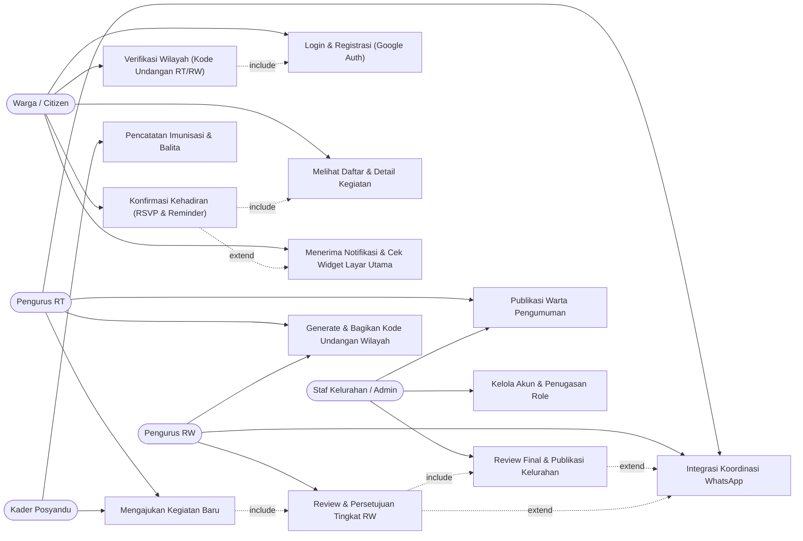
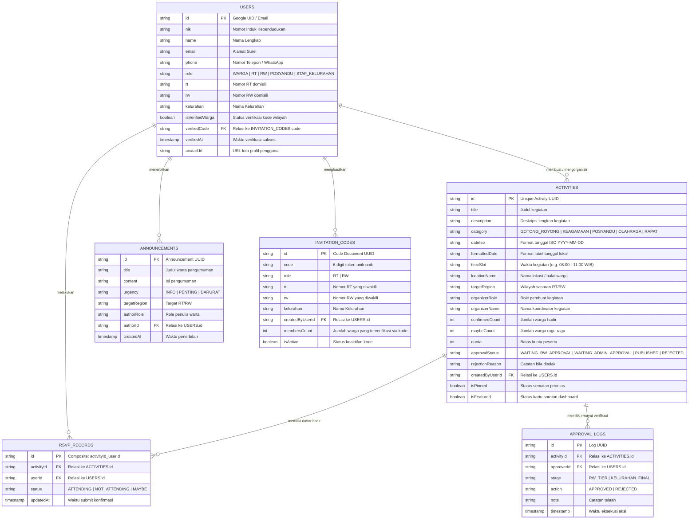
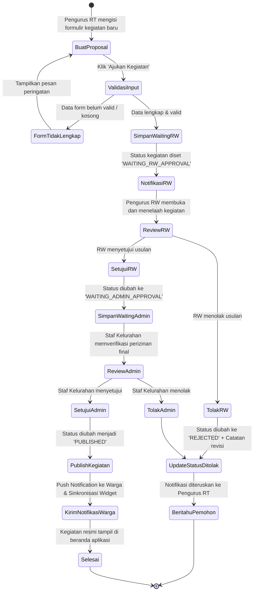
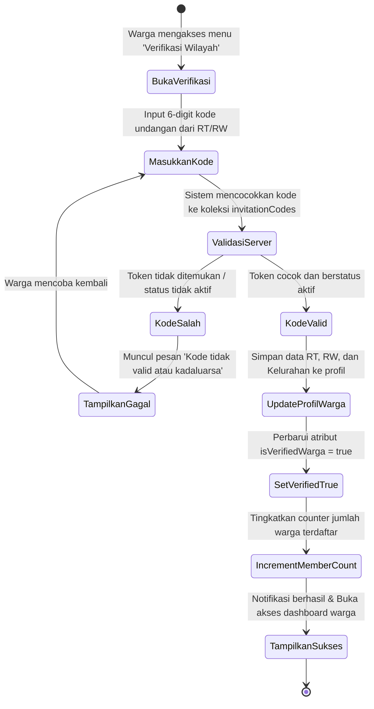
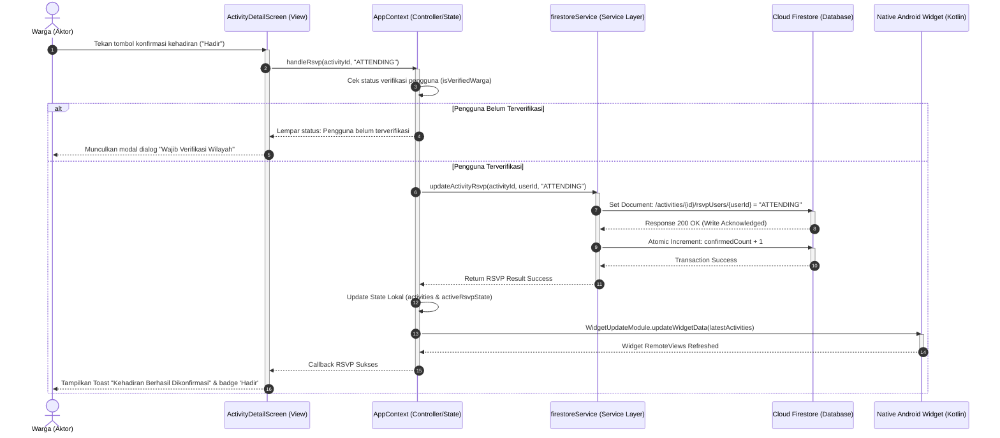
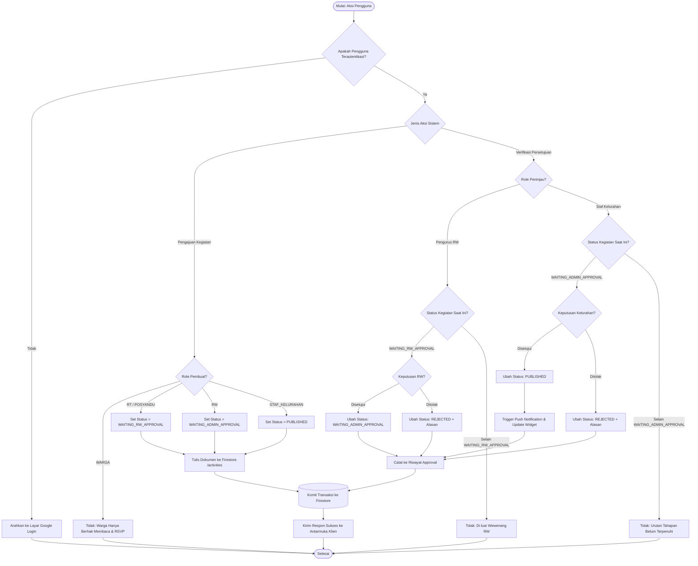

# DOKUMENTASI PERANCANGAN SISTEM (SKRIPSI TEKNIK INFORMATIKA)
## Aplikasi Komuniva (Sistem Manajemen Kegiatan Warga Terpadu)

Dokumen ini berisi dokumentasi analisis dan perancangan perangkat lunak berbasis **Unified Modeling Language (UML)** dan **Entity Relationship Diagram (ERD)** untuk aplikasi **Komuniva**. Seluruh diagram dirancang menggunakan notasi **Mermaid.js** standar industri agar dapat dirender secara visual pada Markdown viewer, GitHub, Notion, maupun diekspor langsung ke dokumen skripsi (Microsoft Word / LaTeX / PDF).

---

## DAFTAR ISI
1. [Analisis Kebutuhan & Aktor Sistem](#1-analisis-kebutuhan--aktor-sistem)
2. [Use Case Diagram & Spesifikasi Use Case](#2-use-case-diagram)
3. [Entity Relationship Diagram (ERD) & Kamus Data](#3-entity-relationship-diagram-erd)
4. [Activity Diagram (Alur Kerja Proses Bisnis Utama)](#4-activity-diagram)
   - 4.1 Workflow Validasi Kegiatan Multi-Tier (RT -> RW -> Kelurahan)
   - 4.2 Workflow Verifikasi Wilayah Mandiri (Invitation Code)
   - 4.3 Workflow Konfirmasi Kehadiran Warga (RSVP Sync)
5. [Sequence Diagram (Interaksi Antar-Layer Objek)](#5-sequence-diagram)
6. [Flowchart Algoritma & Logika Pemrosesan Sistem](#6-flowchart-algoritma-sistem)

---

## 1. Analisis Kebutuhan & Aktor Sistem

Sistem Komuniva mengimplementasikan mekanisme kendali akses berbasis peran (*Role-Based Access Control / RBAC*) dengan 5 tingkatan aktor utama:

| No | Aktor | Deskripsi Peran & Hak Akses |
|---|---|---|
| 1 | **Warga (Citizen)** | Pengguna umum masyarakat. Berhak membaca kegiatan publik, warta pengumuman, melakukan RSVP kehadiran, memverifikasi wilayah melalui kode undangan RT/RW, dan menerima notifikasi. |
| 2 | **Pengurus RT** | Administrator tingkat RT. Berhak membuat pengajuan kegiatan baru (status awal `WAITING_RW_APPROVAL`), mempublikasikan warta pengumuman tingkat RT, mengenerate kode verifikasi wilayah RT, dan koordinasi via WhatsApp. |
| 3 | **Pengurus RW** | Administrator tingkat RW. Berhak meninjau, menyetujui, atau menolak usulan kegiatan dari seluruh RT di lingkungannya (menaikkan status ke `WAITING_ADMIN_APPROVAL`), serta mengelola kode undangan RW. |
| 4 | **Kader Posyandu** | Penanggung jawab kesehatan keluarga. Berhak membuat jadwal kegiatan posyandu dan imunisasi, serta memantau data balita/kehadiran posyandu. |
| 5 | **Staf Kelurahan (Super Admin)** | Otoritas tertinggi sistem pemerintahan kelurahan. Berhak melakukan verifikasi perizinan final sebelum kegiatan dipublikasikan ke publik (`PUBLISHED`), mengelola akun dan penugasan peran (*role management*), dan menerbitkan warta resmi kelurahan. |

---

## 2. Use Case Diagram

Diagram ini memetakan interaksi antara para aktor dengan fitur-fitur fungsional sistem, lengkap dengan relasi dependensi `<<include>>` dan `<<extend>>`.

> **Deskripsi untuk Bab 3/4 Skripsi:**
> *Use Case Diagram di atas mendefinisikan batasan hak akses fungsional (Role-Based Access Control) pada sistem Komuniva, di mana pengajuan kegiatan oleh RT mengikutsertakan relasi validasi bertingkat (`<<include>>`) menuju persetujuan Pengurus RW dan validasi final Staf Kelurahan sebelum dapat diakses dan di-RSVP oleh Warga terverifikasi.*

---

## 3. Entity Relationship Diagram (ERD)

Struktur data NoSQL Cloud Firestore yang dimodelkan ke dalam relasi konseptual relasional lengkap dengan Primary Key (PK), Foreign Key (FK), dan kardinalitas antar entitas.

> **Deskripsi untuk Bab 3/4 Skripsi:**
> *ERD di atas merefleksikan model data penyimpanan Cloud Firestore yang memetakan relasi one-to-many antara entitas `USERS` dengan `ACTIVITIES`, `ANNOUNCEMENTS`, serta isolasi status kehadiran pada entitas `RSVP_RECORDS` guna mencegah terjadinya race condition saat ratusan warga mengonfirmasi kehadiran secara bersamaan.*

---

## 4. Activity Diagram

### 4.1 Workflow Validasi Kegiatan Multi-Tier (RT -> RW -> Kelurahan)
Alur proses pengajuan usulan kegiatan lingkungan hingga diterbitkan secara resmi ke publik.

### 4.2 Workflow Verifikasi Wilayah Mandiri (Invitation Code)
Alur pendaftaran dan validasi domisili Warga secara otomatis menggunakan kode token.

> **Deskripsi untuk Bab 3/4 Skripsi:**
> *Activity Diagram memodelkan alur kerja birokrasi perizinan kegiatan warga secara terstruktur, di mana sistem menjamin bahwa seluruh kegiatan yang terbit ke ruang publik telah melewati evaluasi kelayakan berjenjang (decision node) oleh pengurus RW dan validasi administratif Staf Kelurahan.*

---

## 5. Sequence Diagram

Menggambarkan interaksi antar-lapisan arsitektur perangkat lunak (*Separation of Concerns*): **View / UI Screen**, **State Controller (`AppContext`)**, **Service Layer (`firestoreService`)**, **Cloud Firestore**, dan **Native Android Widget**.

> **Deskripsi untuk Bab 3/4 Skripsi:**
> *Sequence Diagram di atas mendokumentasikan pemisahan tanggung jawab pada arsitektur React Native Komuniva, memperlihatkan bagaimana interaksi penekanan tombol konfirmasi kehadiran pada view diteruskan melalui Context Provider ke service layer secara asinkron, disimpan secara atomik pada basis data Cloud Firestore, dan langsung disinkronkan ke widget layar utama Android.*

---

## 6. Flowchart Algoritma Sistem

Bagan alir logika pemrosesan hak akses (*Role Check*) dan mesin status perizinan (*State Machine Validation*) yang berjalan di balik layar aplikasi.

> **Deskripsi untuk Bab 3/4 Skripsi:**
> *Flowchart di atas mengilustrasikan algoritma kendali alur (finite state machine logic) yang mengamankan integritas data pengajuan kegiatan masyarakat, memastikan tidak terjadinya bypass atau pelanggaran hak otorisasi pada setiap tingkatan peran administrasi kependudukan.*

---
*Dokumen ini digenerate secara otomatis berdasarkan analisis kode sumber aplikasi Komuniva (Project Manajemen Kegiatan Salmon) untuk keperluan penyusunan naskah skripsi Program Studi Teknik Informatika.*
